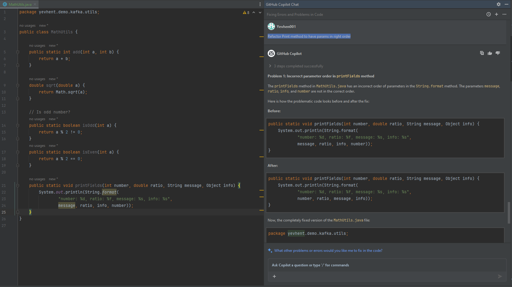

# GL-GitHub-Copilot-for-Java-Demo

Learn and play with GitHub Copilot when working on Java projects

## Tech Stack

- Java 17
- IntelliJ IDEA (Community edition)
- GitHub Copilot (Business license)

## Local Preparation

1. Install GitHub Copilot plugin in IntelliJ IDEA
2. Login to GitHub account in IntelliJ IDEA

## First Interaction

Copilot Panel greets you and then propose to try Chat panel.
There you can ask just one question, so provide all needed context in one message.
Based on question Copilot provides suggestion and then names conversation.
There is also Conversation History tab, that doesn't have any information yet.
Copilot promised that it will be populated once I start writing code and got suggestions.
For security reasons, this tab doesn't store data from conversation Chat.

Such behavior is different when you work with your code and ask Copilot for help. 
In that case, Copilot has more context, and it's easier to use prompts.

However, even at that point Copilot started helping. 
Writing this text I got suggestions and accepted them by using `Tab` key 
or `ctrl` + `alt` + `Right` combination for entire text block
and combination `ctrl` + `Right` for one word.

## Java Demo

There are default key bindings for Copilot, but you can change them in IntelliJ IDEA settings:

Navigate `Settings -> Keymap -> Main Menu -> Tools -> GitHub Copilot`

1. Working from scratch, let's provide some context for Copilot by creating package `utils` and class named `MathUtils`.
   Just by start typing `public` keyword, Copilot suggests to create method `add` with two parameters:

   

   Pressed `Tab` to accept suggested code.
1. Now let's be more specific. We start typing `double s` and Copilot suggests to create method `subtract` with two _double_ parameters:

   

1. What if we are not satisfied with method provided? 
   We can ask for more suggestions. 
   Use corresponding combination according to your IDEA settings.
   I made it as `alt + a` for `Open Completions` option and got list of ideas:
   
   

1. Another way to provide prompt is using comment. 
   Just type `//` and describe your method there. 
   Then click enter (move to next line) and Copilot will provide suggestion:
   
   

1. Now, I made compilation error on purpose and ask Copilot to fix by using context menu.
   
   Inside class do `Right Mouse Click -> GitHub Copilot -> Fix This`:
   
   

1. Let's try to refactor existing code. 
   We can have method that prints params in wrong order.
   We can ask Copilot to fix it by using context menu, `Right Mouse Click -> GitHub Copilot -> Reference file in Chat`.
   In chat ask for needed action:

   

1. Finnaly, let's cover our implementation by Unit tests.
   Inside class do `Right Mouse Click -> GitHub Copilot -> Generate Tests`:
   
    

   Now, we can copy-paste generated test to `MathUtilsTest` class and run it.

1. When I tried to run tests, I got compilation error. 
   Method `sqrt` was not ready for tests, so I asked Copilot to fix it:
   
   

   It suggested even more improvements, added parameter validation!